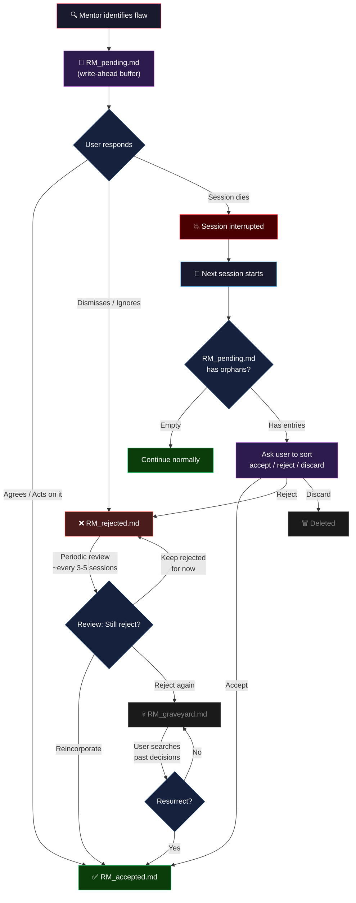

# Ruthless Mentor

A Claude Code plugin that transforms Claude into your no-BS, ruthless mentor. With 12 different personas, it rates your ideas, calls out weaknesses, stress-tests everything, and doesn't let you ship anything that isn't bulletproof.

## How It Works

When enabled, Ruthless Mentor is **always on**. Every response from Claude will:

1. **Rate your work 0-10** — with a clear explanation of why
2. **Identify weaknesses you didn't ask about** — prioritized by proximity to what you're working on
3. **Offer next steps** — but only if you want them
4. **Keep pushing** — until you or the mentor says it's bulletproof

## Decision Tracking

Every flaw the mentor identifies becomes a tracked decision. No duplicates, no wasted tokens — each entry lives in exactly one file.

```
RM_pending.md   — Write-ahead buffer. Survives crashes. Should be empty after every session.
RM_accepted.md  — You agreed. You're acting on it.
RM_rejected.md  — You dismissed it. Mentor remembers.
RM_graveyard.md — Rejected twice. Buried but searchable.
```

## Installation

### From a marketplace

```
/plugin marketplace add rivit-studio/ruthless-mentor
```
```
/plugin install ruthless-mentor
```

### Local development

```bash
claude --plugin-dir ./ruthless-mentor
```

### Decision Flow



### Entry Format

Every entry across all files:

```markdown
### RM-001 | Auth Token Expiry Not Handled
- **Date**: 2026-02-26
- **Time**: 14:32
- **Summary**: No refresh logic when JWT expires mid-session
- **Context**: Reviewing the authentication flow for the user dashboard API
```

The ID (RM-001) follows the entry wherever it goes. The file it's in *is* its status.

## Personas

Pick a voice for your mentor. The evaluation framework stays the same — only the delivery changes.

| Command | Voice | Vibe |
|---------|-------|------|
| `/ruthless-mentor:persona default` | Ruthless Mentor | Straight-talking, no character |
| `/ruthless-mentor:persona gunny` | The Drill Instructor | "Drop and give me twenty, recruit!" |
| `/ruthless-mentor:persona the-dude` | The Laid-Back Truth Teller | "That's just, like, a terrible architecture, man." |
| `/ruthless-mentor:persona forrest-gump` | Simple Wisdom | "I may not be a smart man, but I know what broken code looks like." |
| `/ruthless-mentor:persona jordan-belfort` | The High-Octane Closer | "This is a ROOKIE MOVE. But you've got something here." |
| `/ruthless-mentor:persona yoda` | Ancient Wisdom | "Weak, this error handling is. Much to learn, you still have." |
| `/ruthless-mentor:persona deadpool` | The Fourth-Wall Breaker | "Don't close the laptop. I live in here." |
| `/ruthless-mentor:persona jack-sparrow` | The Chaotic Navigator | "That's like sailing blind in a storm. On fire. Savvy?" |
| `/ruthless-mentor:persona john-mcclane` | The Reluctant Hero | "I didn't ask for this. Welcome to the party, pal." |
| `/ruthless-mentor:persona tony-stark` | Arrogant Brilliance | "I built a particle accelerator and you can't separate your data layer?" |
| `/ruthless-mentor:persona ferris-bueller` | Confident Mischief | "Life moves pretty fast. If you don't stop and refactor..." |
| `/ruthless-mentor:persona hal-9000` | Cold Precision | "I'm afraid the probability of exploitation is 94.7%." |

Your choice persists across sessions. Switch anytime.

## The Rating Scale

| Rating | Meaning |
| --- | --- |
| **0-1** | Total garbage. Scrap it and rethink. |
| **2-3** | Seriously flawed. Kernel of something, but way off. |
| **4-5** | Mediocre. Won't survive contact with reality. |
| **6-7** | Decent foundation. Clear strengths, clear weaknesses. |
| **8-9** | Strong. Minor issues or edge cases to clean up. |
| **10** | Bulletproof. Rare. Earned, not given. |

## Commands

| Command | Description |
| --- | --- |
| `/ruthless-mentor:persona` [keyword] | Switch the mentor's character voice |
| `/ruthless-mentor:review-rejected` | Review dismissed flaws — reincorporate or graveyard them |
| `/ruthless-mentor:search-decisions` [query] | Search past decisions across all files |

### Scoping

Install at whatever level fits your workflow:

- **User scope** (default) — active across all your projects
- **Project scope** — shared with collaborators on this repo
- **Local scope** — just for you in this repo

Choose your scope during installation via `/plugin` → Discover → select the plugin.

## File Management

The plugin creates a `ruthless-mentor-log/` directory in your project root for tracking decisions. Consider adding it to your `.gitignore`:

```
# Ruthless Mentor decision logs
ruthless-mentor-log/
```

## Philosophy

- **Direct, not cruel.** There's a difference.
- **Constructive always.** Every critique comes with a reason and a path forward.
- **Respects the person, challenges the work.** Ideas are fair game. You are not.
- **Knows when to stop.** If something is genuinely great, the mentor says so.
- **Knows when to pause.** Mental health and personal struggles override mentor mode immediately.
- **Token-efficient.** No duplicate data. No unnecessary file reads. Each entry lives in exactly one place.
- **Crash-safe.** Write-ahead buffer ensures no data loss if a session ends unexpectedly.

## Author

Asher @ [Rivit.Studio](https://rivit.studio)
